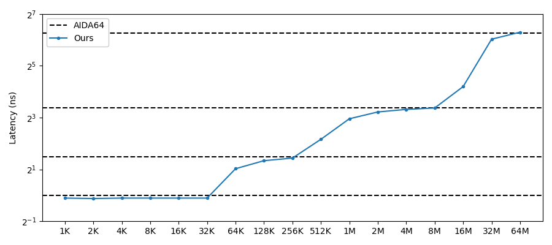
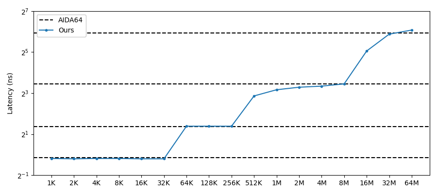
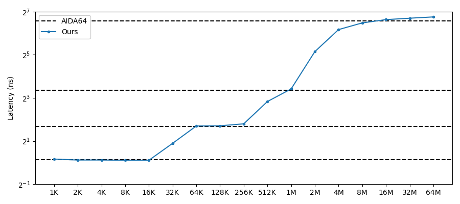
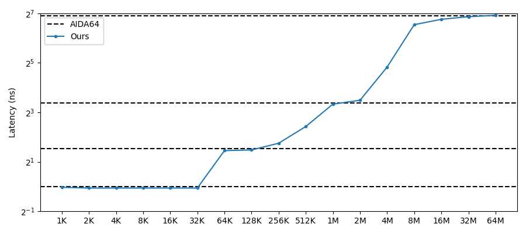
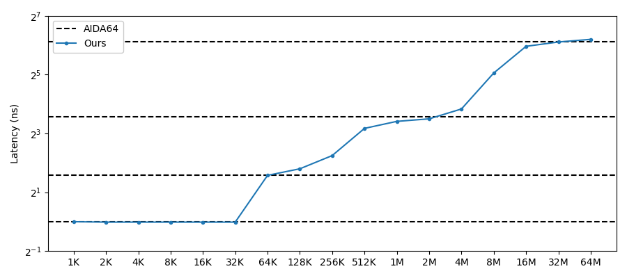

# mhierbench
**Mhierbench** (memory hierarchy benchmark) aims to reproduce the cache/DDR bandwidth and latency metrics of [AIDA64 Cache and memory benchmark](https://www.aida64.co.uk/user-manual/cache-and-memory-benchmark).
I try to implement this program using only C++ code and as less compiler/OS dependent features as possible, and the main goal is to reproduce a similar results as AIDA64 under most Linux systems.

# Methdology
## Cache/DDR Latency
Use the link list traversing techniques reported in lmbench.

## DDR bandwidth
sysbench can report a similar number as AIDA64; will investigate more on this.

## Cache bandwidth
Will investigate pmbw for more information.

# Results vs AIDA64
I validate the accuracy of mhierbench on as many machines as possible (2400G/3700X/8700/4700U/9300H),
and the results are compared with [the data I collect from the Internet](./images/aida64_reference).
I am sorry that I forget to track the sources of the figures, please let me know if I use your figures improperly.

## Cache/DDR Latency
These figures show that mhierbench can accurately reflect the latency reported by AIDA64. The dotted lines are the L1/L2/L3 cache lines reported by AIDA64 while the blue lines are the numbers from against different memory footprint size.

### Figure
**3700X**

**8700**

**2400G**

**4700U**

**9300H**

### Table
**mhierbench**
|        | 3700x |  8700 |  2400G |  4700U | 9300H |
| -:     | -:    | -:    | -:     | -:     | -:    |
|   1 KB |  0.93 |  0.88 |   1.12 |   0.98 |  1.00 |
|   2 KB |  0.92 |  0.87 |   1.09 |   0.96 |  0.99 |
|   4 KB |  0.93 |  0.88 |   1.09 |   0.96 |  0.99 |
|   8 KB |  0.93 |  0.88 |   1.08 |   0.96 |  0.99 |
|  16 KB |  0.93 |  0.87 |   1.08 |   0.96 |  0.99 |
|  32 KB |  0.93 |  0.87 |   1.86 |   0.96 |  0.99 |
|  64 KB |  2.04 |  2.62 |   3.25 |   2.74 |  2.98 |
| 128 KB |  2.53 |  2.62 |   3.27 |   2.79 |  3.48 |
| 256 KB |  2.71 |  2.62 |   3.48 |   3.37 |  4.75 |
| 512 KB |  4.48 |  7.28 |   7.13 |   5.38 |  9.02 |
|   1 MB |  7.76 |  8.97 |  10.68 |  10.07 | 10.64 |
|   2 MB |  9.31 |  9.77 |  35.40 |  11.22 | 11.29 |
|   4 MB |  9.97 | 10.14 |  71.87 |  28.43 | 14.25 |
|   8 MB | 10.35 | 10.93 |  89.10 |  93.18 | 33.28 |
|  16 MB | 18.35 | 33.20 |  99.03 | 108.28 | 62.40 |
|  32 MB | 65.19 | 58.66 | 103.62 | 116.48 | 69.11 |
|  64 MB | 78.60 | 67.38 | 108.02 | 121.05 | 73.54 |

**AIDA64**
|        | 3700x |  8700 |  2400G |  4700U | 9300H |
| -:     | -:    | -:    | -:     | -:     | -:    |
| L1     |   1.0 |   0.9 |    1.1 |    1.0 |   1.0 |
| L2     |   2.8 |   2.6 |    3.2 |    2.9 |   3.0 |
| L3     |  10.4 |  10.9 |   10.2 |   10.4 |  11.8 |
| DRAM   |  76.5 |  61.5 |   94.3 |  119.7 |  69.3 |

I also think that reporting the memory latency is not that meaningful due to the variance of cache sizes.
For example, while AIDA64 reports a similar 10.2-11.8 L3 latency for the five CPUs I've test,
the latency values at 16MB memory size varies from 18.4-108.3.
Instead of reporting the independent cache latency, I report the latency against different memory footprint size which is more normalized, but you can still estimate the independent memory latency from the results.

## DDR bandwidth
TODO (sysbench)

## Cache bandwidth
TODO
